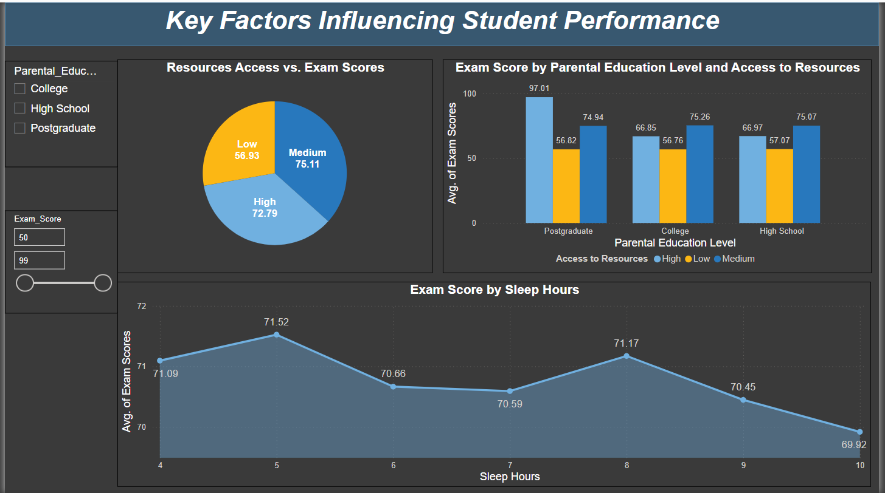
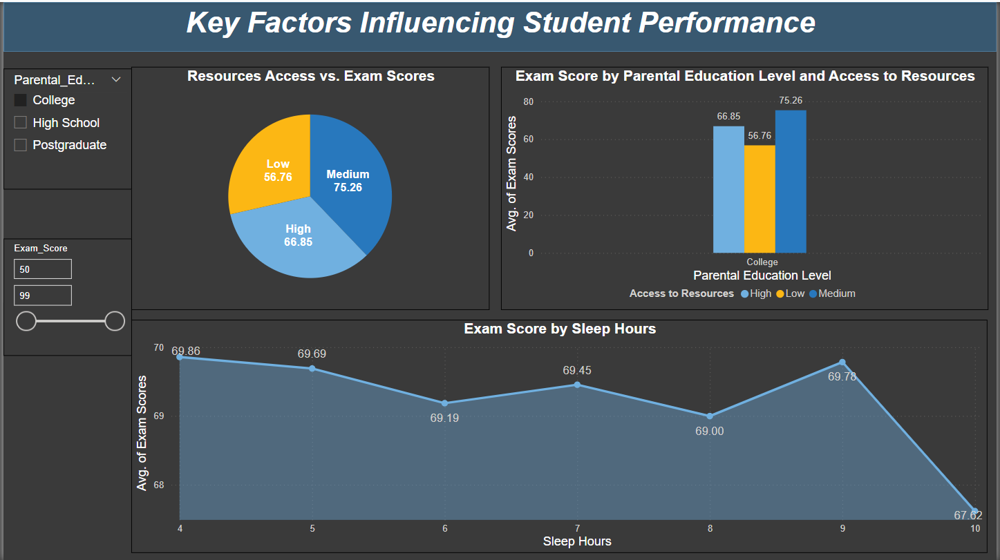
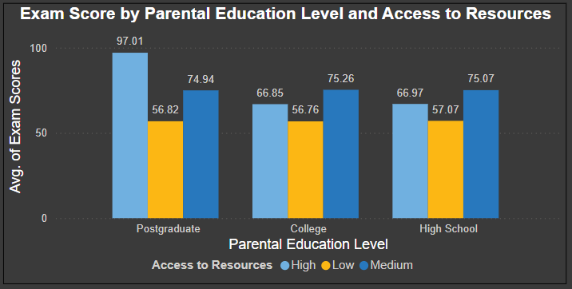
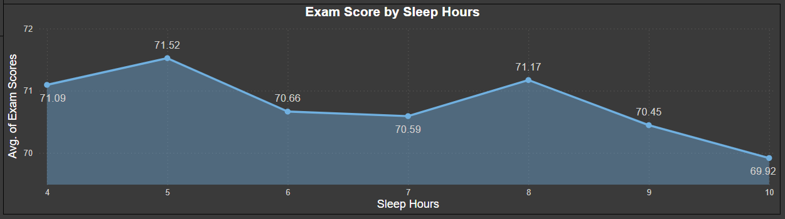

# Students-Performance-Dashboard

Power BI dashboard analyzing key factors influencing student performance, including parental education, resource access, and sleep hours.

## Dashboard Overview

## Dynamic Slicers

## Features
- **Resources Access vs. Exam Scores:**  
  A pie chart highlighting average scores based on low, medium, or high access to resources.  
  

- **Exam Score by Parental Education Level:**  
  A bar chart showing the correlation between parental education levels, resource access, and student performance.  
  

- **Exam Score by Sleep Hours:**  
  A line graph depicting how average sleep hours affect student exam scores.  
  

## Tools Used
- **Power BI:** For dashboard creation and visualization.
- **Data Processing:** Cleaned and transformed data for analysis.

## Key Insights
- Students with higher access to resources tend to score better in exams.
- Parental education levels significantly correlate with student performance.
- Optimal sleep hours (around 7–8 hours) positively influence exam scores.
